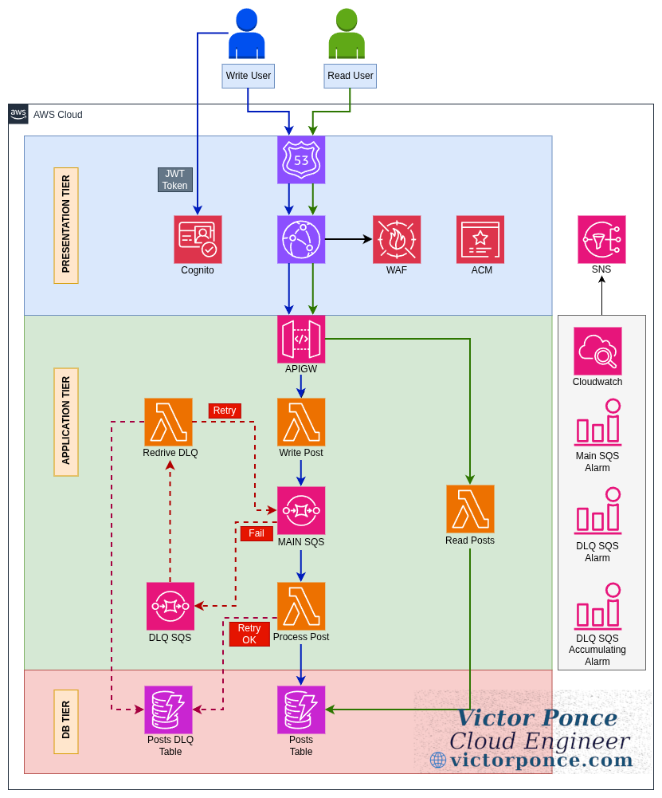
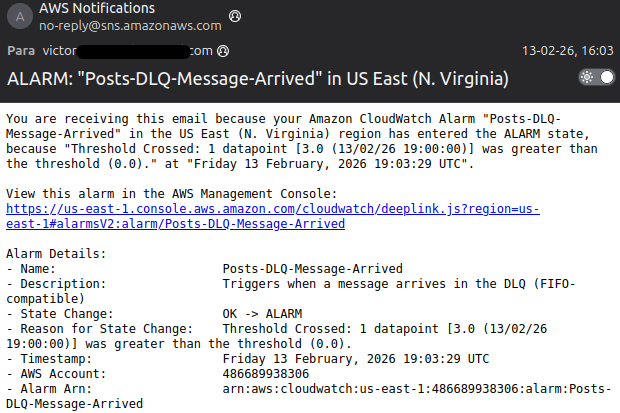
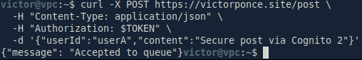
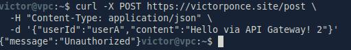
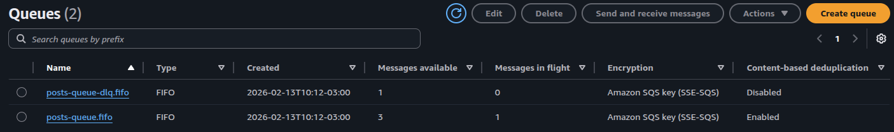
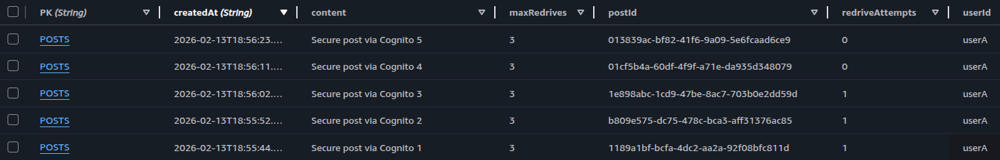
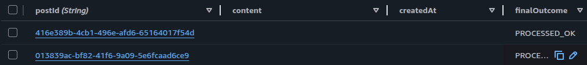
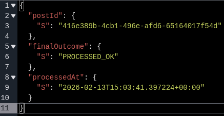
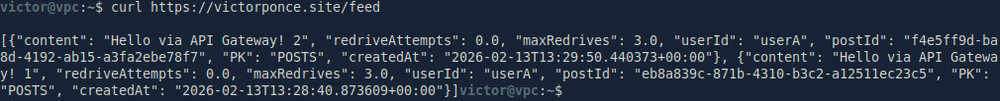

# Proyecto: Aplicación Multi-capa Serverless Segura
**Autor:** Victor Ponce | **Contacto:** [Linkedin](https://www.linkedin.com/in/victorhugoponce) | **Sitio Web:** [victorponce.com](https://victorponce.com)

**English Version:** [README.md](https://github.com/victorhponcec/portfolio-disaster-recovery-multi-region/blob/main/README.md)

## 1. Resumen General

Esta infraestructura ejecuta una aplicación multi-capa utilizando exclusivamente componentes *serverless*. Las capas de la aplicación se dividen en: Capa de Presentación, que incluye autenticación, seguridad y componentes de acceso; Capa de Aplicación, que contiene la lógica central y el procesamiento; y la Capa de Base de Datos, que almacena el contenido y gestiona el control de fallos.

La aplicación cuenta con dos flujos principales: Escritura (*Write*), donde el usuario publica contenido, y Lectura (*Read*), que permite visualizar las publicaciones. Existe un tercer flujo encargado de gestionar fallos de procesamiento en la escritura, el cual registra los errores y reintenta el envío a la cola principal.

<div align="center">


<p><em>(img. 1 – Diagrama de Arquitectura)</em></p>
</div>

## 2. Capa de Presentación

La Capa de Presentación gestiona todas las peticiones mediante un dominio personalizado integrado con Route 53. CloudFront distribuye el contenido de forma segura (integrado con WAF y ACM) tanto para los flujos de lectura como de escritura. La autenticación para el flujo de Escritura (Post) es gestionada por Cognito.

## 3. Capa de Aplicación

Esta capa maneja la lógica de procesamiento mediante servicios *serverless*, lo que en arquitecturas tradicionales requeriría instancias EC2 y grupos de Auto Scaling. API Gateway expone las funciones Lambda de "Write Post" y "Read Posts".

Se utiliza SQS para desacoplar el proceso de escritura, separando la Lambda de recepción (que toma los parámetros) de la Lambda de procesamiento (que escribe en la base de datos). También se implementó un flujo de reintentos que se detalla más adelante.

## 4. Capa de Base de Datos

La tabla de DynamoDB “Posts” almacena el contenido generado por los usuarios. Una segunda tabla, “PostsDLQ”, guarda los mensajes que no pudieron ser procesados tras los intentos iniciales.

A continuación, la configuración detallada de las tablas:

### Configuración de Tabla Posts:

| Propiedad     | Valor                |
| ------------- | -------------------- |
| Nombre        | `Posts`              |
| Modo Factura | `PAY_PER_REQUEST`    |
| Partition Key | `PK` (String)        |
| Sort Key      | `createdAt` (String) |

| Nombre Atributo | Tipo   | Propósito                                          |
| -------------- | ------ | -------------------------------------------------- |
| `PK`           | String | Clave de partición                                 |
| `createdAt`    | String | Timestamp ISO para ordenamiento (más reciente primero) |
| `userId`       | String | Identifica al autor de la publicación              |

| Nombre de Índice | Partition Key | Sort Key    | Proyección |
| ---------------- | ------------- | ----------- | ---------- |
| `UserPostsIndex` | `userId`      | `createdAt` | `ALL`      |

### Configuración de Tabla PostsDLQ (Dead Letter Queue):

| Propiedad     | Valor             |
| ------------- | ----------------- |
| Nombre        | `PostsDLQ`        |
| Modo Factura | `PAY_PER_REQUEST` |
| Partition Key | `postId` (String) |

| Nombre Atributo | Tipo   | Propósito                                      |
| --------------- | ------ | ---------------------------------------------- |
| `postId`        | String | Identificador único del post fallido           |
| `lastAttemptAt` | String | Timestamp del último intento de procesamiento  |

| Nombre de Índice | Partition Key   | Proyección |
| ---------------- | --------------- | ---------- |
| `ByLastAttempt`  | `lastAttemptAt` | `ALL`      |

<p><em>(Tablas 1-2 – Tablas de DynamoDB)</em></p>

## 5. Flujos de Trabajo (Workflows)

### 5.1 Flujo de Lectura (Read)

No requiere autenticación. Los usuarios acceden vía Route 53 y CloudFront, el cual llama al endpoint (GET /feed) en API Gateway, invocando la Lambda de lectura que consulta la tabla "Posts" en DynamoDB.

### 5.2 Flujo de Escritura (Write)

Permite publicar contenido. El acceso es vía CloudFront y API Gateway, pero este último exige autorización mediante Cognito para el endpoint (POST /post). 

El proceso está desacoplado: la petición llega a una cola SQS FIFO. La Lambda de Procesamiento consume los mensajes en orden y los inserta en la tabla "Posts".

### 5.3 Flujo de Reintentos (Retry)

Se activa si la Lambda de procesamiento falla (mensajes malformados, límites de DynamoDB, etc.). 

Mediante una *Redrive Policy*, si un mensaje falla 3 veces en la cola principal, se envía a una SQS de "Letra Muerta" (DLQ). Una Lambda de recuperación toma estos fallos, registra el error en la tabla "PostsDLQ" y devuelve el mensaje a la cola principal para un nuevo ciclo, evitando bucles infinitos.

```
resource "aws_sqs_queue_redrive_policy" "posts_redrive" {
  queue_url = aws_sqs_queue.posts_fifo.id

  redrive_policy = jsonencode({
    deadLetterTargetArn = aws_sqs_queue.posts_fifo_dlq.arn
    maxReceiveCount     = 3
  })
}
```

## 6. Monitoreo

Se configuraron tres alarmas de CloudWatch para supervisar la salud de las colas SQS, las cuales notifican vía email mediante un tópico SNS.

<div align="center">

| Nombre de la Alarma                | Recurso Monitoreado | Métrica                                           | Umbral               | Condición de Activación                         | Propósito                                                |
| ----------------------------------- | -------------------- | ------------------------------------------------- | -------------------- | ----------------------------------------------- | -------------------------------------------------------- |
| **Posts-DLQ-Message-Arrived**       | Cola SQS DLQ         | `NumberOfMessagesReceived` (Sum, 60s)            | > 0                  | Al menos 1 mensaje llega a la DLQ              | Detecta fallos de procesamiento de forma inmediata      |
| **Posts-DLQ-Message-Stale**         | Cola SQS DLQ         | `ApproximateAgeOfOldestMessage` (Max, 60s)       | > 300 seg (5 min)    | Un mensaje permanece demasiado tiempo en la DLQ | Detecta fallos del procesador DLQ o recuperación detenida |
| **Posts-Main-Queue-Backlog**        | Cola SQS Principal   | `ApproximateAgeOfOldestMessage` (Max, 60s)       | > 180 seg (3 min)    | Mensajes esperando demasiado tiempo en la cola principal | Detecta desaceleración en el procesamiento o throttling de Lambda |

<p><em>(Tabla 3 – Alarmas de métricas de CloudWatch)</em></p>

</div>

<div align="center">


<p><em>(img. 2 – SNS Email Notificación)</em></p>
</div>

## 7. Seguridad

La solución integra tres servicios principales de seguridad de AWS:

### 7.1 Cognito

Cognito gestiona la autenticación de usuarios. El User Pool almacena y administra las credenciales.  
Los clientes generan un token JWT validado por API Gateway para autorizar el acceso al endpoint de escritura que les permite "postear" contenido. (Tabla 4)

<div align="center">

| Propiedad                     | Valor                     | Propósito                                           |
| ----------------------------- | ------------------------- | --------------------------------------------------- |
| **Nombre del User Pool**      | `victor-site-user-pool`   | Almacena y gestiona los usuarios de la aplicación  |
| **Atributo de Usuario**       | `email`                   | Los usuarios inician sesión con su correo electrónico en lugar de un nombre de usuario |
| **Atributo Auto-Verificado**  | `email`                   | El correo electrónico se verifica automáticamente al registrarse |
| **Atributo Requerido**        | `email`                   | El correo electrónico es obligatorio para el registro |
| **Tipo de Atributo**          | `String`                  | El correo electrónico se almacena como cadena de texto |
| **Atributo Mutable**          | `true`                    | Los usuarios pueden actualizar su correo electrónico |

<p><em>(Tabla 4 – Configuración del User Pool de Cognito)</em></p>

</div>


### 7.2 AWS WAF

CloudFront actúa como capa de protección frente a API Gateway, evitando acceso directo.

Se aplican reglas administradas por AWS que protegen contra:

<div align="center">

| Prioridad | Nombre de la Regla                     | Tipo                  | Acción    | Descripción                                                                 |
| ---------- | -------------------------------------- | --------------------- | --------- | --------------------------------------------------------------------------- |
| 1          | AWSManagedRulesCommonRuleSet           | Grupo de Reglas Administradas | Default   | Protecciones base contra amenazas comunes                                   |
| 2          | RateLimitPerIP                         | Regla Basada en Tasa  | Block     | Bloquea IPs que superen 800 solicitudes en 5 minutos (protección DDoS/fuerza bruta) |
| 3          | AWSManagedRulesSQLiRuleSet             | Grupo de Reglas Administradas | Default   | Detecta intentos de inyección SQL                                            |
| 4          | AWSManagedRulesAmazonIpReputationList  | Grupo de Reglas Administradas | Default   | Detecta/bloquea solicitudes provenientes de IPs maliciosas conocidas (inteligencia de amenazas de AWS) |

<p><em>(Tabla 5 – Reglas de WAF)</em></p>

</div>

### 7.3 AWS ACM

Se utiliza AWS Certificate Manager para generar y asociar un certificado TLS al dominio personalizado.

Esto permite cifrar la comunicación entre el usuario y CloudFront, asegurando la transmisión de datos.

## 8. End-to-End testing

El flujo Write se prueba enviando el token de Cognito junto con el contenido hacia CloudFront: 

<div align="center">


<p><em>(img. 3 – Invocación a Cloudfront con Token de Cognito)</em></p>
</div>

Si el token no es enviado, la solicitud es rechazada por falta de autorización.

<div align="center">


<p><em>(img. 4 – Invocación a Cloudfront sin Token de Cognito)</em></p>
</div>

Podemos verificar el estado de los mensajes en la consola de AWS. En la captura de abajo se observan las colas SQS principal y la de letra muerta (DLQ). Los mensajes en tránsito ("Messages in Flight") están siendo procesados por sus funciones Lambda correspondientes, mientras que los mensajes disponibles ("Messages Available") están a la espera de ser procesados:

<div align="center">


<p><em>(img. 5 – SQS Queues)</em></p>
</div>

Los mensajes procesados correctamente son escritos en la tabla **Posts**:

<div align="center">


<p><em>(img. 6 – Tabla DynamoDB Posts)</em></p>
</div>

Los mensajes que fallan se insertan en la tabla **PostsDLQ** de DynamoDB y, una vez que son procesados correctamente tras el reintento, su estado cambia a PROCESSED_OK:

<div align="center">


<p><em>(img. 7 – Tabla DynamoDB PostDLQ)</em></p>
</div>

<div align="center">


<p><em>(img. 8 – JSON Payload para PostDLQ)</em></p>
</div>

Finalmente, podemos verificar nuestro flujo de Lectura invocando el endpoint HTTP **/feed** a través de CloudFront, el cual devuelve todos los registros de la tabla Posts:

<div align="center">


<p><em>(img. 9 – Invocación a Cloudfront para flujo Read)</em></p>
</div>