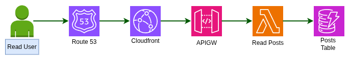
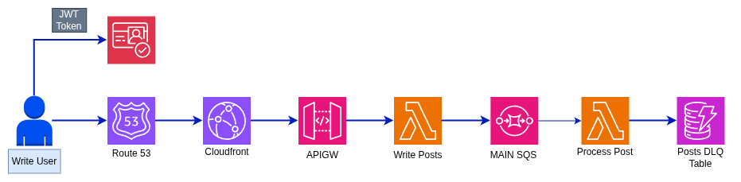

# Project: Secure Serverless Multi-tier Application
**Author:** Victor Ponce | **Contact:** [Linkedin](https://www.linkedin.com/in/victorhugoponce) | **Website:** [victorponce.com](https://victorponce.com)

🇪🇸 **Versión en Español:** [README.es.md](https://github.com/victorhponcec/portfolio-3tier-serverless-pbc/blob/main/README.es.md)

**Notas:** *The code for this project is in a private repository. Feel free to contact me if you want to access it.* 

## 1. Overview

The present infrastructure runs a multi-tier application using serverless components only. The layers of the application are separated into: the Presentation tier, which includes authentication, security, and access components; the Application tier, which contains the core logic and processing; and the Database tier, which stores the application content and handles failure control.

The app has two main workflows: Write, where a user can post content to the database, and Read, which allows users to read posts. There is a third workflow that handles processing failures from the Write workflow. This workflow records all failures and redrives them to the main queue.

<div align="center">


<p><em>(img. 1 – Architecture Diagram)</em></p>
</div>

## 2. Presentation Tier

The Presentation Tier handles all requests through a custom domain integrated with Route 53. CloudFront serves the content to users securely (WAF and ACM integrations) for both Write and Read workflows. Authentication is handled by Cognito for the Write(Post) workflow.

## 3. Application Tier

The Application Tier handles the processing logic using serverless services, which in other architectures would require EC2 instances and Auto Scaling Groups. An API Gateway exposes the Lambda functions Write Post and Read Posts.

SQS is used to decouple the writing process, separating the Writing Lambda (which receives the parameters) from the Processing Lambda (which writes to the database). There is also a retry workflow, which will be explained in detail later.

## 4. Database Tier

The DynamoDB table “Posts” stores the content generated by users, written by the Process Post Lambda. A second table, PostsDLQ, stores messages that could not be processed by the main Write workflow.

Below is the detailed configuration for each table.


### Posts Table Configuration:

| Property      | Value                |
| ------------- | -------------------- |
| Table Name    | `Posts`              |
| Billing Mode  | `PAY_PER_REQUEST`    |
| Partition Key | `PK` (String)        |
| Sort Key      | `createdAt` (String) |

| Attribute Name | Type   | Purpose                                          |
| -------------- | ------ | ------------------------------------------------ |
| `PK`           | String | Partition key                   |
| `createdAt`    | String | ISO timestamp for sorting (newest first queries) |
| `userId`       | String | Identifies the author of the post                |

| Index Name       | Partition Key | Sort Key    | Projection |
| ---------------- | ------------- | ----------- | ---------- |
| `UserPostsIndex` | `userId`      | `createdAt` | `ALL`      |

### PostsDLQ Table (Dead Letter Queue) Configuration:

| Property      | Value             |
| ------------- | ----------------- |
| Table Name    | `PostsDLQ`        |
| Billing Mode  | `PAY_PER_REQUEST` |
| Partition Key | `postId` (String) |

| Attribute Name  | Type   | Purpose                              |
| --------------- | ------ | ------------------------------------ |
| `postId`        | String | Unique identifier for failed post    |
| `lastAttemptAt` | String | Timestamp of last processing attempt |

| Attribute Name  | Type   | Purpose                              |
| --------------- | ------ | ------------------------------------ |
| `postId`        | String | Unique identifier for failed post    |
| `lastAttemptAt` | String | Timestamp of last processing attempt |

| Index Name      | Partition Key   | Projection |
| --------------- | --------------- | ---------- |
| `ByLastAttempt` | `lastAttemptAt` | `ALL`      |

<p><em>(Table 1-2 – DynamoDB tables)</em></p>

## 5. Workflows

The application consists of Write, Read, and Retry workflows. Next, we explain each one.

### 5.1 Read Workflow

Users do not need authentication for this workflow. They access the posts through a custom domain (Route 53), which interacts with CloudFront. CloudFront calls the read (GET /feed) HTTP API endpoint from API Gateway, invoking the Read Posts Lambda function.

This Lambda retrieves the posts from the DynamoDB Posts table. API Gateway sends the response back to the CloudFront distribution, which then returns the information to the user.

<div align="center">


<p><em>(img. 2 – Read Workflow)</em></p>
</div>

### 5.2 Write Workflow

This workflow allows users to post content to the application. They access the service through a custom domain (Route 53), which redirects to a CloudFront distribution.

API Gateway requires authorization to access the POST /post HTTP API endpoint, which is handled by Cognito. The API invokes the Write Post Lambda.

The process of writing to the database is decoupled using a FIFO queue (Main SQS) to temporarily store the posts. These messages are taken one by one, in order of arrival, by the Process Post Lambda function, which inserts them into the Posts table.

<div align="center">


<p><em>(img. 3 – Write Workflow)</em></p>
</div>

### 5.3 Retry Workflow

The Retry workflow is triggered when the Process Post Lambda encounters problems processing posts. This can be caused by malformed messages, DynamoDB throughput being exceeded, Lambda timeouts, among other issues.

A Redrive Policy is configured on the Main SQS queue to send messages that fail processing after three attempts to the DLQ SQS queue (maxReceiveCount SQS parameter).

The Redrive DLQ Lambda picks up failed messages from the DLQ queue, inserts a retry record into the PostsDLQ table, and sends the message back to the Main SQS queue for reprocessing.

If the message is reprocessed successfully, the Process Post Lambda writes a success state to the PostsDLQ table; otherwise, it records a failure state.

The Redrive DLQ Lambda attempts to reprocess failed messages up to three times to avoid an infinite loop of permanently failing messages being retried repeatedly. The following terraform code creates the policy that follows the logic just explained.

```
resource "aws_sqs_queue_redrive_policy" "posts_redrive" {
  queue_url = aws_sqs_queue.posts_fifo.id

  redrive_policy = jsonencode({
    deadLetterTargetArn = aws_sqs_queue.posts_fifo_dlq.arn
    maxReceiveCount     = 3
  })
}
```

<div align="center">


<p><em>(img. 4 – Retry Workflow)</em></p>
</div>

## 6. Monitoring

Three CloudWatch alarms are in place to monitor the health of the Main SQS and DLQ SQS queues. The alarms trigger an SNS topic that notifies stakeholders via email (img. 2). The details of each alarm are shown in Table 3.

### Cloudwatch Alarms

<div align="center">


| Alarm Name                    | Monitored Resource | Metric                                     | Threshold         | Trigger Condition                       | Purpose                                           |
| ----------------------------- | ------------------ | ------------------------------------------ | ----------------- | --------------------------------------- | ------------------------------------------------- |
| **Posts-DLQ-Message-Arrived** | DLQ SQS Queue      | `NumberOfMessagesReceived` (Sum, 60s)      | > 0               | At least 1 message arrives in DLQ       | Detects processing failures immediately           |
| **Posts-DLQ-Message-Stale**   | DLQ SQS Queue      | `ApproximateAgeOfOldestMessage` (Max, 60s) | > 300 sec (5 min) | A message remains too long in DLQ       | Detects DLQ processor failure or stalled recovery |
| **Posts-Main-Queue-Backlog**  | Main SQS Queue     | `ApproximateAgeOfOldestMessage` (Max, 60s) | > 180 sec (3 min) | Messages waiting too long in main queue | Detects processing slowdown or Lambda throttling  |
<p><em>(Table 3 – CloudWatch metric alarms)</em></p>
</div>

<div align="center">


<p><em>(img. 5 – SNS Email Notification)</em></p>
</div>

## 7. Security

Three AWS security services are used to protect the application: Cognito, WAF, and ACM. They are detailed below.

### 7.1 Cognito

Users must authenticate through Cognito to access the Post API endpoint from API Gateway, served through CloudFront.

A Cognito User Pool stores and manages application users. The client generates a JWT token through Cognito, which is validated by API Gateway and allows access to the service (posting content). See Table 4.

<div align="center">

| Property                    | Value                   | Purpose                                      |
| --------------------------- | ----------------------- | -------------------------------------------- |
| **User Pool Name**          | `victor-site-user-pool` | Stores and manages application users         |
| **Username Attribute**      | `email`                 | Users sign in with email instead of username |
| **Auto-Verified Attribute** | `email`                 | Email is automatically verified upon signup  |
| **Required Attribute**      | `email`                 | Email is mandatory for registration          |
| **Attribute Type**          | `String`                | Email stored as string                       |
| **Attribute Mutable**       | `true`                  | Users can update their email     
<p><em>(Table 4 – Cognito User Pool Configuration)</em></p>
</div>

### 7.2 WAF

A CloudFront distribution serves content to end users, preventing direct communication between users and API Gateway. This allows us to protect the distribution using AWS WAF with AWS-managed rules:

<div align="center">

| Priority | Rule Name                             | Type               | Action                        | Description                                                                           |
| -------- | ------------------------------------- | ------------------ | ----------------------------- | ------------------------------------------------------------------------------------- |
| 1        | AWSManagedRulesCommonRuleSet          | Managed Rule Group | Default                       | Baseline protections against common threats |
| 2        | RateLimitPerIP                        | Rate-Based Rule    | Block                         | Blocks IPs exceeding 800 requests in 5 minutes (DDoS/brute-force protection)          |
| 3        | AWSManagedRulesSQLiRuleSet            | Managed Rule Group | Default                       | Detects SQL injection attempts                                                        |
| 4        | AWSManagedRulesAmazonIpReputationList | Managed Rule Group | Default                       | Detects/block requests from known malicious IPs (AWS threat intelligence)               |
<p><em>(Table 5 – WAF rules)</em></p>
</div>

### 7.3 AWS ACM

An SSL/TLS certificate is generated using AWS Certificate Manager for the custom domain and attached to the CloudFront distribution.

This enables encrypted communication (TLS) between the user and CloudFront, securing data in transit.

## 8. End-to-End testing

We start the Write(post) workflow by passing the Coginto Token and the content to Cloudfront: 

<div align="center">


<p><em>(img. 6 – Cloudfront invoke with Cognito Token)</em></p>
</div>

Notice that if we don’t pass the token we won’t be able to start the workflow, receiving an authorized message: 

<div align="center">


<p><em>(img. 7 – Cloudfront invoke without Cognito Token)</em></p>
</div>

We can verify the state of the messages in the AWS Console. In the capture below we can see the Main and DLQ SQS queues. “Messages in Flight” are being processed by the corresponding lambda functions, meanwhile “Messages Availables” are waiting processing:

<div align="center">


<p><em>(img. 8 – SQS Queues)</em></p>
</div>

Messages processed correctly are written to the **Posts DynamoDB table**:

<div align="center">


<p><em>(img. 9 – DynamoDB Posts Table)</em></p>
</div>

Messages that failed are inserted into the the **PostDQL DynamoDB table** and once they were reprocessed correctly they change their status to PROCESSED_OK:

<div align="center">


<p><em>(img. 10 – DynamoDB PostDLQ Table)</em></p>
</div>

<div align="center">


<p><em>(img. 11 – JSON Payload for PostDLQ)</em></p>
</div>

Finally, we can verify our **Read** workflow by invoking the **/feed** http endpoint through Cloudfront which will return all the registries from the Posts table:

<div align="center">


<p><em>(img. 12 – Cloudfront Invoke for Read Workflow)</em></p>
</div>

## 9. Conclusion

This project demonstrates the design and implementation of a fully serverless, event-driven, multi-tier application on AWS. By leveraging managed services such as API Gateway, Lambda, SQS, DynamoDB, Cognito, CloudFront, WAF, and CloudWatch, the architecture achieves high availability, scalability, fault tolerance, and security without relying on traditional infrastructure components like EC2 instances or Auto Scaling Groups.

The system is separated into **Presentation**, **Application**, and **Database** tiers while incorporating asynchronous processing and retry mechanisms to improve resilience. The use of SQS to decouple the Write workflow from database persistence ensures that the system can absorb traffic spikes, handle failures, and maintain data integrity.

Additionally, the implementation of monitoring, alerting, and security best practices ensures visibility and protection against misuse or system degradation. This architecture reflects modern cloud-native design principles and robust fault-tolerant system design.

